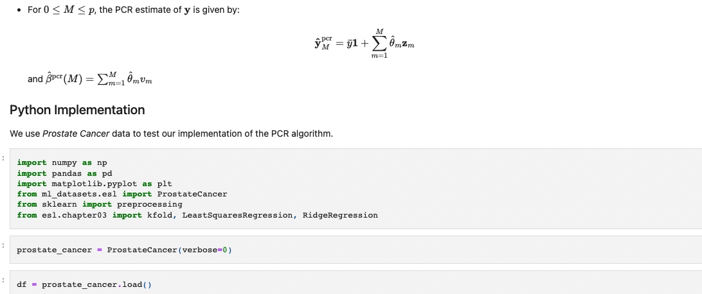

<h1 align='center'> Hi! :wave:</h1>

I'm Arief, a Machine Learning Engineer/Data Scientist.

I work on cool projects every day. Unfortunately, I cannot share my work-related work here due to the confidentiality nature of the work. However, when I have free time, I enjoy working on things outside my work:

- [`The Elements of Statistical Learning`](https://hastie.su.domains/ElemStatLearn/) book is, in my opinion, one of the must-read books if you are a data scientist. It provides thorough mathematical explanations of most of the important machine/statistical learning models. I have been working on deriving some of the algorithms and implementing them from scratch in Python. Check out the [repo](https://github.com/abkoesdw/The-Elements-of-Statistical-Learning-Python-Codes)

  

- I have been building a python package for retrieving machine learning datasets: [`ml-datasets`](https://github.com/abkoesdw/ml-datasets)
- A python porting of MATLAB code to produce some results in this [paper](https://www.sciencedirect.com/science/article/abs/pii/S0012821X17301838)
- More to come ...

**[Website](https://arief.ca)** • **[Youtube](https://www.youtube.com/user/abekaabeka)**
<!--
**abkoesdw/abkoesdw** is a ✨ _special_ ✨ repository because its `README.md` (this file) appears on your GitHub profile.

Here are some ideas to get you started:

- 🔭 I’m currently working on ...
- 🌱 I’m currently learning ...
- 👯 I’m looking to collaborate on ...
- 🤔 I’m looking for help with ...
- 💬 Ask me about ...
- 📫 How to reach me: ...
- 😄 Pronouns: ...
- ⚡ Fun fact: ...
-->
